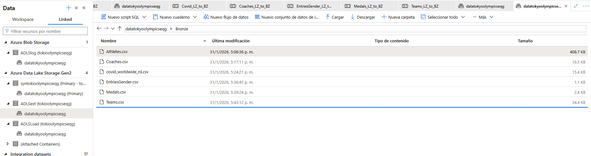
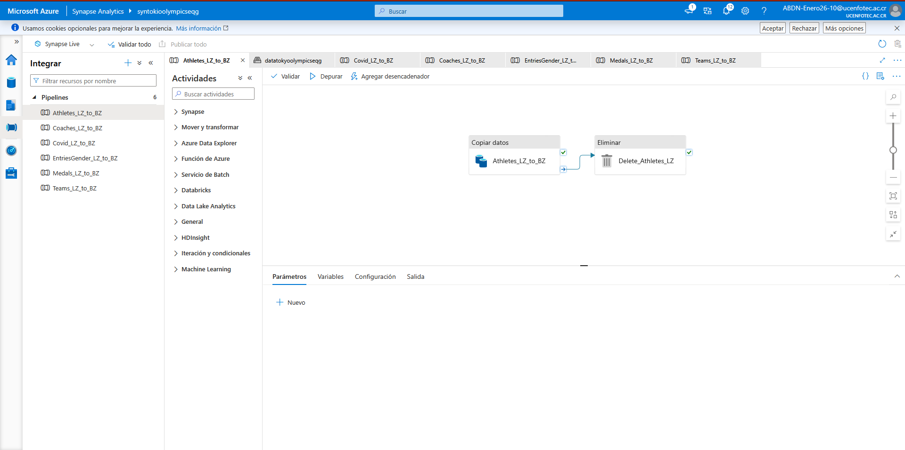
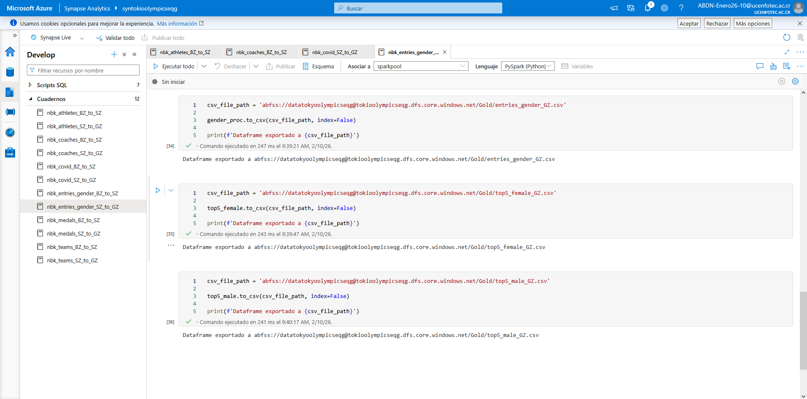
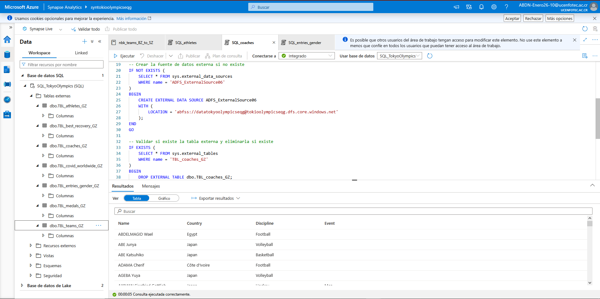

# Azure Synapse ETL Pipeline — Tokyo 2020 Olympics & COVID-19 Analytics

End-to-end data pipeline built on **Azure Synapse Analytics**, implementing a Medallion architecture (Bronze → Silver → Gold) to process data from the Tokyo 2020 Olympic Games and global COVID-19 statistics, delivering a final analytical model ready for BI consumption.

## Architecture

The project uses **Azure Data Lake Storage Gen2** with three layer-specific containers (`ADLSext`, `ADLSLoad`, and the main container `datatokyoolympicseqg`), plus **Azure Blob Storage** for pipeline logging. Data lands in the Bronze layer in its original format (CSV), preserving raw data traceability.

**Datasets processed:** Athletes, Coaches, Medals, Teams, Entries by Gender, COVID-19 Worldwide.

## 1. Ingestion (Bronze) — Azure Data Factory / Synapse Pipelines

Six independent pipelines were built (one per dataset) using **Copy Data** activities from source into the Bronze layer, followed by a **Delete** activity to clean up the Landing Zone after successful ingestion. Each pipeline has logging enabled to Blob Storage for execution auditing.

## 2. Transformation (Silver → Gold) — PySpark Notebooks

Twelve PySpark notebooks were developed on Synapse's Spark Pool — two per dataset (`BZ_to_SZ` for cleaning/standardization, and `SZ_to_GZ` for analytical aggregation). The notebooks generate business metrics such as:
- Top 5 female/male athletes by discipline
- Medal distribution by country (`gold_share`)
- Participation count by gender and discipline

## 3. Analytical Consumption — External Tables and Lake Database

Gold-layer data is exposed through **external tables in Synapse's serverless SQL Pool**, pointing directly to the Data Lake — no data duplication required. This allows querying with standard T-SQL for validation and direct consumption from BI tools.

### Data Model (Lake Database)

The final Gold-layer model is structured as a **Lake Database with 8 related tables**:

| Table | Content |
|---|---|
| `TBL_Athletes_GZ` | Athletes by country and discipline |
| `TBL_coaches_GZ` | Coaches by country and discipline |
| `TBL_teams_GZ` | Teams by discipline and country |
| `TBL_medals_GZ` | Medal count by country (gold, silver, bronze, total, gold %) |
| `TBL_gold_share_GZ` | Percentage share of gold medals by country |
| `TBL_entries_gender_GZ` | Participation by gender and discipline |
| `TBL_top_male_GZ` / `TBL_top_female_GZ` | Top participation by discipline and gender |

## Tech Stack

- **Azure Synapse Analytics** (Pipelines, Spark Pool, Serverless SQL Pool, Lake Database)
- **Azure Data Lake Storage Gen2** + **Azure Blob Storage** (logging)
- **PySpark** for distributed transformation
- **T-SQL** on external tables for analytical consumption

## Project Status

Fully functional end-to-end pipeline, executed and validated: ingestion of all 6 datasets, transformation across 12 notebooks, and a Gold-layer model queryable via SQL. Execution evidence available in `/screenshots`.

## Next Steps

- [ ] Migrate orchestration to Azure Data Factory with scheduled triggers
- [ ] Add granular access control (Azure Key Vault for secrets, RBAC on the Data Lake, Unity Catalog-style governance)
- [ ] Automate infrastructure deployment with Terraform
- [ ] Add data quality tests (Great Expectations or dbt tests)

## 👤 Author

**Emmanuel Quesada G.**
Data Engineering Student — Universidad Cenfotec
[GitHub](https://github.com/EmmanuelQuesadaG)
